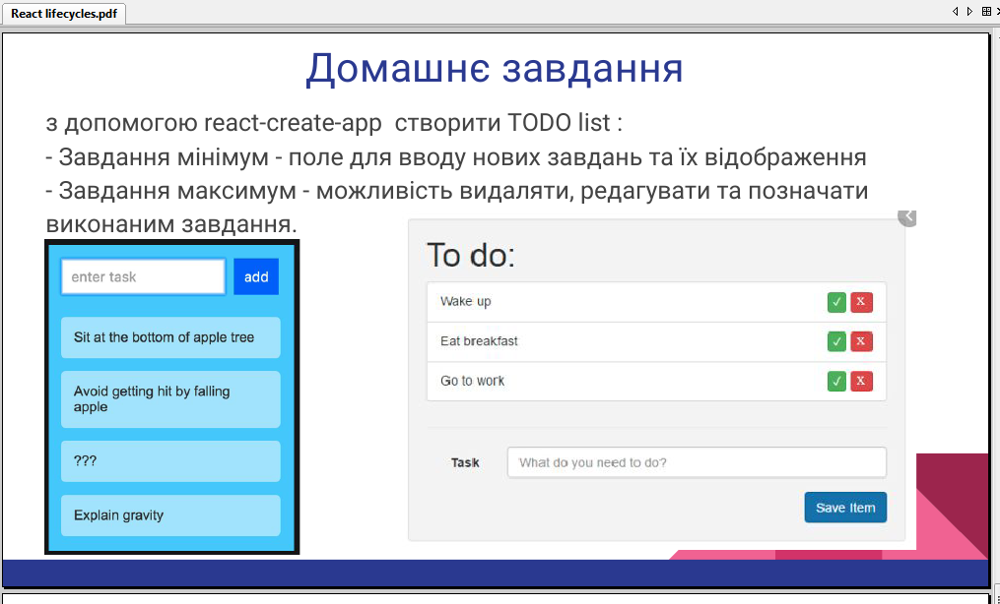

## Useful information about difficult case with state, props, and components.

- https://www.robinwieruch.de/react-state-array-add-update-remove
>
- https://stackoverflow.com/questions/43638938/updating-an-object-with-setstate-in-react
>
- https://itnext.io/updating-properties-of-an-object-in-react-state-af6260d8e9f5
>
- https://www.robinwieruch.de/react-list-component
>
- https://www.npmjs.com/package/classnames

### tz

